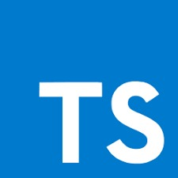

<a href="https://www.notion.so/Type-5712aeab312d44fcba0aa88895caad36"></a>

# Node com TypeScript


_Demonstra conceitos basicos de TypeScript com Node.js_


## Getting Started
Clone o Repositorio e execute os seguintes comandos:
```sh
yarn -> install dependecies;
yarn dev  -> run code;
```


<!-- CONTACT -->

## Contato

Lucas Lamar - [Github](https://github.com/lucaslamar) - **lucass.lamar@gmail.com**
